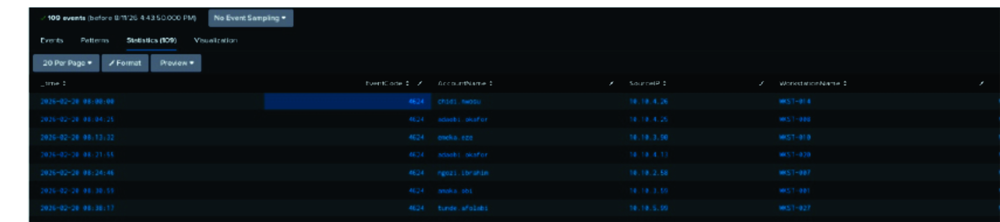

# SOC Incident Investigation & Incident Response
## Splunk Queries

The Splunk queries used during the investigation are available in the `queries` folder.

**[View Investigation Queries](queries/)**

## Project Overview

This project is a **controlled SOC cybersecurity training exercise** focused on investigating a simulated banking security incident.

The investigation used **Splunk, Nessus, Python, and Kali Linux** to analyze evidence from web access logs, Windows authentication logs, and banking transaction logs.

The investigation reconstructed an attack involving **SQL injection, service-account compromise, lateral movement, process execution, and fraudulent transactions**.

## Tools & Technologies

* **Splunk Enterprise** — SIEM and log analysis
* **Nessus** — Vulnerability assessment
* **Python 3.10+** — Security data analysis
* **Kali Linux** — Security analysis environment
* **Docker / Docker Compose** — Lab environment

## Investigation Areas

### 1. SQL Injection Investigation

Analyzed Apache web access logs to identify the attacker's source IP, automated tool, repeated login attempts, and successful access to the banking login endpoint.

### 2. Lateral Movement

Correlated Windows authentication events to identify the compromised `svc_report` service account and trace movement from `WEBSVR01` to `TXNSVR04`.

### 3. Process Execution

Analyzed Windows Event ID **4688** to identify execution of a Python-based transfer script on the transaction server.

### 4. Fraudulent Transaction Investigation

Filtered banking transaction logs to identify five fraudulent transfers initiated by the compromised service account.

**Total fraudulent amount:** NGN 13,094,902.94

## Key Findings

The investigation reconstructed the following attack chain:

**Initial SQL Injection → Service Account Compromise → Privilege Assignment → Lateral Movement → Python Script Execution → Fraudulent Transfers**

The evidence was correlated across web, Windows, and banking transaction logs to build a complete incident timeline.

## Incident Impact

* **5** fraudulent transfers identified
* **NGN 13,094,902.94** in simulated financial impact
* Compromised service account: `svc_report`
* Entry-point host: `WEBSVR01`
* Transaction server: `TXNSVR04`
* Transfer script: `bulk_transfer.py`

## Remediation Recommendations

The investigation recommended:

* Disable and rotate the compromised service-account credentials
* Isolate affected systems for forensic investigation
* Block the identified attacker source
* Patch the SQL injection vulnerability
* Preserve relevant logs and evidence
* Improve network segmentation
* Deploy SQL injection protection through a WAF
* Monitor abnormal service-account activity
* Monitor scripting interpreters such as Python, PowerShell, and `cmd.exe`
* Implement transaction-level anomaly detection

## Project Report

The complete investigation report is available here:

**[SOC Incident Investigation Report](reports/SOC-Incident-Investigation-Report.pdf)**

## Disclaimer

This project was completed as an **authorized cybersecurity training exercise**. All IP addresses, account numbers, transaction amounts, hostnames, log entries, and vulnerability findings used in the project are **synthetic** and do not represent real customers, employees, or systems.

## Skills Demonstrated

* Security Operations Center (SOC) Analysis
* SIEM Investigation
* Splunk SPL
* Incident Response
* Log Analysis
* Windows Event Log Analysis
* Vulnerability Assessment
* Nessus
* Python Security Analysis
* Attack Timeline Reconstruction
* Threat Detection
* Incident Documentation

## Investigation Evidence

### Web Access Evidence

The web-access investigation was used to identify the attacker's source IP, automated tool, repeated login attempts, and successful access to the login endpoint.

****
### Windows Authentication Evidence

Windows authentication evidence was analyzed to trace the compromised service account and the attacker's movement from the web server to the transaction server.

****
